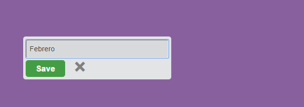
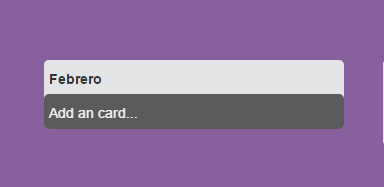

# trello
Versión 0.0.2

1. Mostrar en el HTML, el texto ingresado al dar click en el botón de "Guardar" del formulario (como si fuera título de la lista).
Debajo del título, mostrar el mensaje clickeable de "Añadir una tarjeta". 

