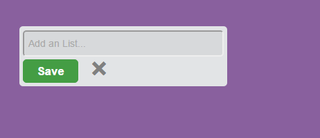

# trello
1. Este trabajo mostrará primero un div y al momento de hacer click en ella aparecerá un pequeño formulario input y un botón (formulario) para que el usuario ingrese el nombre de la lista. 

